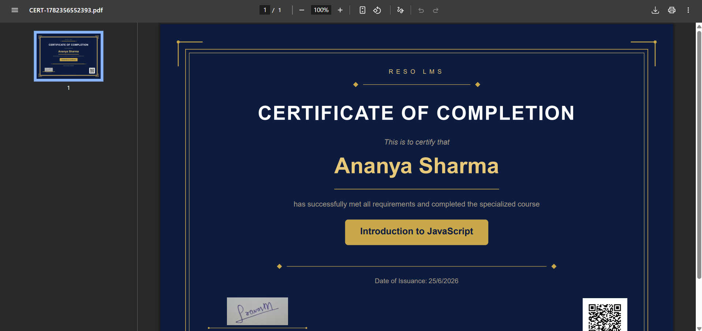

# RESO LMS - Advanced Learning Management System

A comprehensive, full-stack Learning Management System built to facilitate structured online learning, comprehensive assessment, and automated certification. 

## 🌟 Core Features

### 👥 Role-Based Portals
*   **Admin Dashboard**: Dedicated interface for managing users, creating courses, assessing students, and monitoring platform metrics.
*   **Student Dashboard**: Clean, focused interface for students to track their progress, consume content, and submit assessments.

### 📚 Course & Module Management
*   **Structured Content**: Courses are divided into logical Modules.
*   **Rich Media Integration**: Embed YouTube or external video links directly into modules.
*   **Draft & Publish States**: Build out courses privately before publishing them to the student body.

### 📝 Advanced Assessment: Quizzes & Assignments
*   **CSV Quiz Uploads**: Rapidly generate interactive quizzes by uploading a CSV file of questions.
*   **Granular Quiz Controls**: Set custom passing percentage thresholds and optional time limits.
*   **Assignment Submissions**: Create assignments with maximum marks and due dates. Students can submit their work (via URLs), which admins can later review, grade, and provide feedback on.
*   **Attempt Tracking**: Comprehensive admin reporting on student quiz attempts, scores, and pass/fail statuses.

### 🛤️ Strict Progression & Gated Content
*   **Quiz-Gated Modules**: The "Mark as Completed" button for a module is smartly disabled until the student successfully achieves the passing percentage on all associated quizzes.
*   **Automated Progress Tracking**: Visual progress bars and statuses (In Progress vs Completed) automatically update as students navigate the curriculum.

### 🎓 Automated Certificates
*   **PDF Generation**: Auto-generates branded PDF certificates dynamically when course progress hits 100%.
*   **Grading Constraints**: Certificate generation is securely gated. Even if 100% of modules are checked, the system verifies that **all** assignments have been graded by an instructor before releasing the certificate.
*   **Verification**: Each certificate includes a unique verification hash to prove authenticity.

### 💬 Collaborative Learning
*   **Course Discussions**: Integrated forum-style discussion boards where students can ask doubts, share knowledge, and get answers directly from instructors or peers.

### 🎨 Modern, Dynamic UI
*   **Organized Sidebar Layout**: Clean, structured navigation menus grouped by logical sections (Learning Management, User Management, etc.)
*   **Responsive Design**: Built to adapt across desktop and mobile devices.
*   **Interactive Feedback**: Extensive use of toast notifications, empty states, and skeleton loaders to provide a premium user experience.

---

## 📸 Screenshots

Here is a look at the platform in action:

### Student Course Viewer

### Admin Dashboard

### Quiz Attempt Report

### Student Request Review

### Generated Certificate

